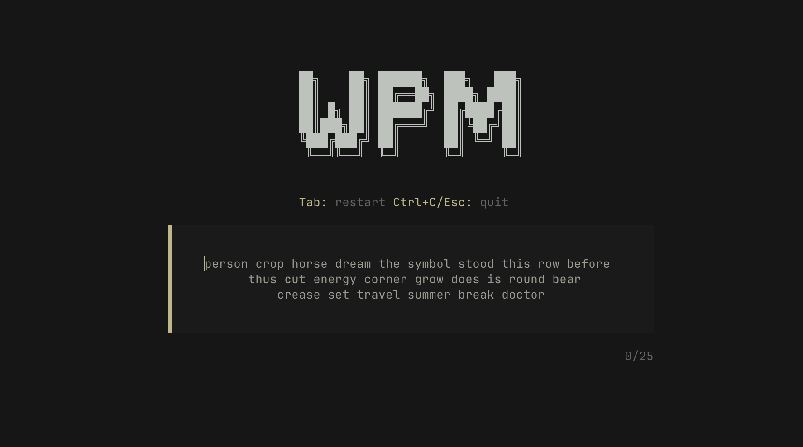

# wpm

A terminal typing speed test built with Rust.



## Installation

```sh
cargo install --path .
```

## Usage

```sh
wpm          # 25 words (default)
wpm 50       # 50 words
wpm 100      # 100 words (max)
```

**Controls:**
- `Tab` — restart
- `Ctrl+C` / `Esc` — quit

## Shoutouts

- [MonkeyType](https://monkeytype.com)
- [toipe](https://github.com/Samyak2/toipe)
- [opencode](https://opencode.ai)
- [Word list](https://gist.github.com/deekayen/4148741)

